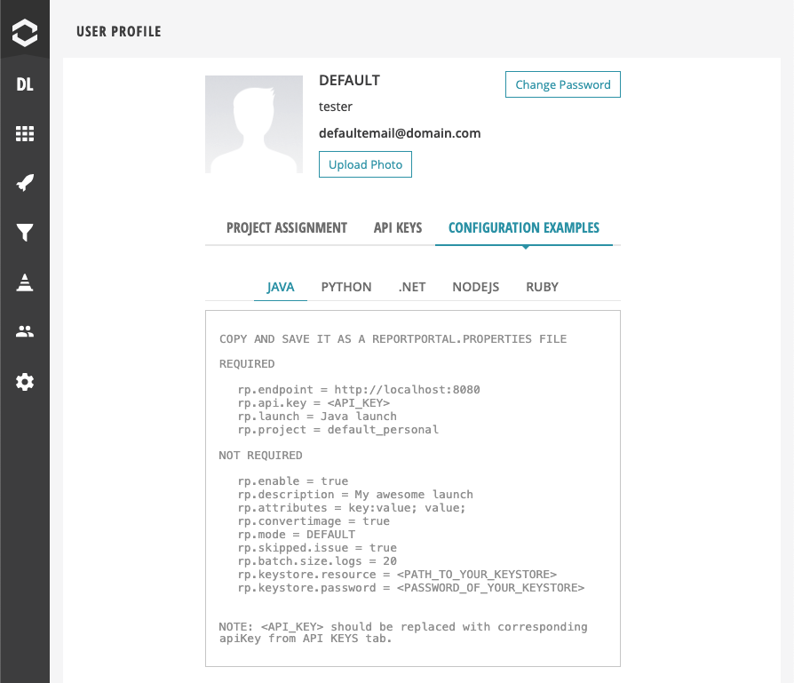

# ReportPortal agent for Cucumber v.6 and v.7

Cucumber JVM version [6.0.0; ) adapter

> **DISCLAIMER**: We use Google Analytics for sending anonymous usage information such as agent's and client's names,
> and their versions after a successful launch start. This information might help us to improve both ReportPortal
> backend and client sides. It is used by the ReportPortal team only and is not supposed for sharing with 3rd parties.

[](https://central.sonatype.com/artifact/com.epam.reportportal/agent-java-cucumber7)
[](https://github.com/reportportal/agent-java-cucumber7/actions/workflows/ci.yml)
[](https://codecov.io/gh/reportportal/agent-java-cucumber7)
[](https://slack.epmrpp.reportportal.io/)
[](http://stackoverflow.com/questions/tagged/reportportal)
[](http://reportportal.io?style=flat)

## Breaking changes

This Agent generates code references in a different way than the previous Agents, and, as a result, it also generates
different Test Case IDs. This means that the history of your tests will be broken, and you will not be able to see the
results reported with previous Agents on the History views of ReportPortal UI. These changes cannot be migrated, so you
will need to accept this as a breaking change. All newly reported tests will be tracked as usual.

## Difference between this and previous versions

The new Cucumber agent for ReportPortal introduces several significant improvements over the previous versions.

### Structural Changes

- **Removed "Root User Story"**: The artificial "dummy" root suite that was previously created has been eliminated,
  making the test structure cleaner and more intuitive. This suite was introduced for ReportPortal server versions 4.x
  compatibility and preserved to maintain backward compatibility. Now it is time to get rid of it.

- **Improved Hierarchy**: Before/After hooks are now properly nested within their parent Scenarios and Steps, creating a
  more logical test structure.

- **Removed StepReporter Class**: The `StepReporter` was already marked as deprecated in the previous versions due to
  the fact that it went against the BDD entity model, which stated a `Scenario` (synonym to `Example`) is the concrete
  example that illustrates a business rule, a specification, documentation and is also a test. Thus, the `StepReporter`
  which treated steps as independent tests violated these principles and was subject to removal.

- **Display name for Features without names**: The Agent now uses a Feature relative path as suite name when a Feature
  does not have a name.

### Test Identification Improvements

- **Enhanced Code References**: Implemented consistent code reference generation similar with what we have in other BDD
  agents. Code references are now generated based on the file path and Scenario name, rather than the file path and
  line number. This change helps to avoid issues when changes to the Feature file breaks history tracking for Scenarios,
  which line numbers were shifted.

- **Test Case ID Support**: Added comprehensive Test Case ID handling, including support for the special `@tc_id` tag.

### Tag Processing Enhancements

- **Tag Format Cleanup**: Removed `@` prefix from tags for cleaner attribute representation.

- **Key-Value Attributes**: Added support for key-value attributes separated by colon (`:`), allowing more structured
  metadata.

- **Rule Keyword Support**: Tags are now properly supported for the Cucumber Rule keyword.

These changes make the ReportPortal Cucumber agent more powerful, easier to use, and better aligned with modern testing
practices.

## Installation

### Build system setup

The agent is available in the Maven Central repository. You can add it to your project using your build system's
dependency management features.

#### Maven

Add to your `pom.xml` to `<dependencies>` section:

```xml

<dependency>
    <groupId>com.epam.reportportal</groupId>
    <artifactId>agent-java-cucumber7</artifactId>
    <version>5.4.1</version>
</dependency>
```

#### Gradle

Add to your `build.gradle` to `dependencies` section:

```groovy
implementation 'com.epam.reportportal:agent-java-cucumber7:5.4.1'
```

For Kotlin DSL build scripts (`build.gradle.kts`):

```kotlin
implementation("com.epam.reportportal:agent-java-cucumber7:5.4.1")
```

### Reporter setup

The agent is designed to be used with the Cucumber JVM framework. To set it up, you need to configure the Cucumber
reporter to use the ReportPortal agent. This is typically done in the `@CucumberOptions` annotation of your test runner
class. Here's an example of how to do this with JUnit 4 runner:

```java
import io.cucumber.junit.Cucumber;
import io.cucumber.junit.CucumberOptions;
import org.junit.runner.RunWith;

@RunWith(Cucumber.class)
@CucumberOptions(
        plugin = {"pretty", "com.epam.reportportal.cucumber.ScenarioReporter"},
        features = "src/test/resources/features",
        glue = "com.example.cucumber.glue"
)
public class RunCucumberTest {
}
```

For more options on how to run your cucumber tests please refer to the Cucumber documentation, but the key thing above
is that you need to specify the `com.epam.reportportal.cucumber.ScenarioReporter` as a plugin:
https://cucumber.io/docs/cucumber/api/#running-cucumber

## Configuration
To configure the ReportPortal agent, you need to create a `reportportal.properties` file in your project. Typically,
this file should be placed in the `src/test/resources` directory of your project. Then you can copy your configuration
from UI of ReportPortal at `User Profile` section:


But parameter number is much broader than listed on the UI. You can find the full list of parameters and supported
features, like Proxy configuration, timeout tuning, etc. in the
[client-java](https://github.com/reportportal/client-java) repository.

## Logging
The agent uses SLF4J for logging, which is just a facade for a logging framework, so you can configure the logging
framework of your choice (e.g., Logback, Log4j). Configuration instructions are located in the corresponding
repositories:
- Logback - https://github.com/reportportal/logger-java-logback
- Log4j - https://github.com/reportportal/logger-java-log4j
